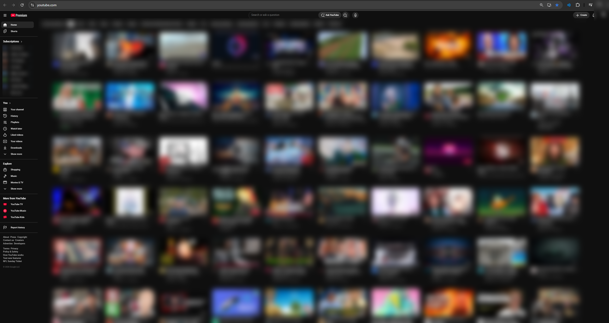

# YouTube Layout Modifier

A Chrome extension that modifies the YouTube layout to remove Shorts and display more videos per row.

## Features

* Removes Shorts from the YouTube homepage and subscriptions page
* Displays more videos per row
* Reduces wasted screen space
* Keeps the standard YouTube viewing experience intact
* Automatically applies layout changes while browsing YouTube

## Example



## Installation

### Install from Source

1. Download or clone this repository.

```bash
git clone https://github.com/YOUR_USERNAME/YOUR_REPOSITORY.git
```

2. Open Chrome and navigate to:

```text
chrome://extensions
```

3. Enable **Developer mode** in the top-right corner.

4. Click **Load unpacked**.

5. Select the folder containing this project.

6. Open or refresh YouTube.

The modified layout should now be applied automatically.

## Usage

Once installed, simply browse YouTube normally.

The extension modifies supported YouTube pages automatically by hiding Shorts and adjusting the video grid to display more videos per row.

## Why?

YouTube's default layout dedicates a significant amount of screen space to large thumbnails and Shorts.

This extension is designed for users who prefer a more compact desktop layout where more traditional videos can be viewed at once.

## Compatibility

Designed for:

* Google Chrome
* Chromium-based browsers that support Chrome extensions

Because YouTube regularly changes its website layout and HTML structure, future YouTube updates may require changes to the extension.

## Development

To modify the extension:

1. Clone the repository.
2. Make your changes.
3. Open `chrome://extensions`.
4. Find the extension.
5. Click the **Reload** button.
6. Refresh YouTube to test your changes.


## Disclaimer

This project is not affiliated with, endorsed by, or sponsored by YouTube or Google.

YouTube is a trademark of Google LLC.
